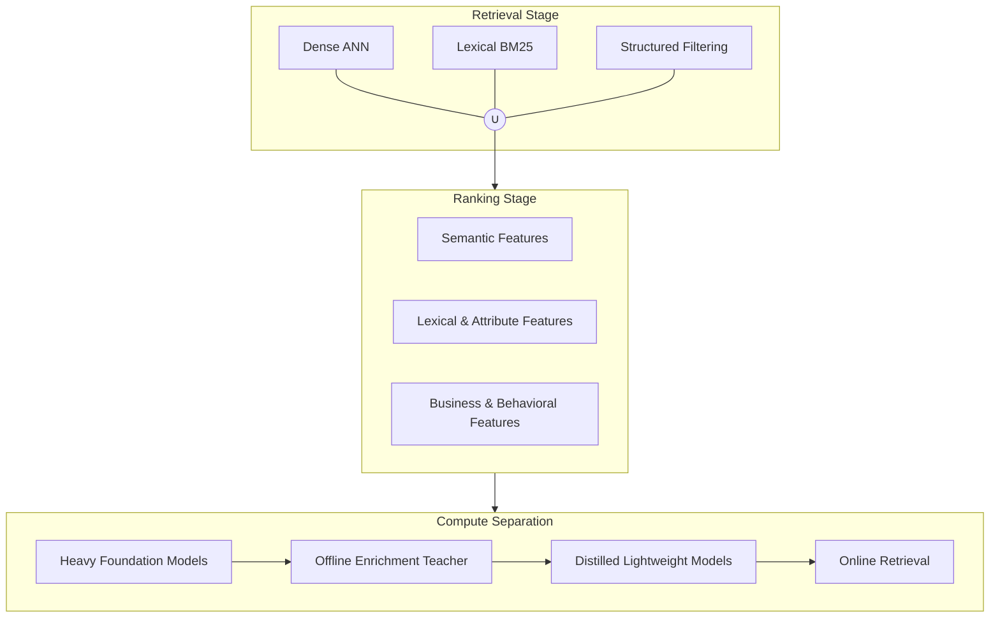

# Vibe Search, Image/Video Search & Ranking

## 1. Subjective / vibe search

Queries such as:

> "90s retro"

> "summer beach party"

> "quiet luxury"

> "streetwear Gen-Z vibe"

do not correspond cleanly to a single structured attribute.

Treat them as **latent semantic concepts**.

```text
                 USER QUERY
                     │
                     ↓
              Query Expansion
                     │
          ┌──────────┼──────────┐
          ↓          ↓          ↓
       Style      Occasion    Context
          │          │          │
          └──────────┼──────────┘
                     ↓
              Multimodal Vector
                     │
                     ↓
                    ANN
```

The enrichment model can associate visual evidence with latent concepts:

```text
Image
 ↓
VLM
 ↓
"90s retro"
"vintage"
"denim"
"oversized"
"streetwear"
```

The resulting product representation allows vocabulary that was never present in the original listing to become searchable.

---

## 2. Image search

```text
USER IMAGE
    │
    ↓
Lightweight image encoder
    │
    ↓
Image embedding
    │
    ↓
ANN
    │
    ↓
Candidate products
    │
    ↓
LTR
    │
    ↓
TOP-K
```

No VLM reasoning is required for the normal path.

---

## 3. Video search

A 5–10 second video should not be treated as a giant raw tensor during online retrieval.

Instead:

```text
USER VIDEO
    │
    ↓
Decode
    │
    ↓
Sample keyframes
    │
    ↓
Remove redundant frames
    │
    ↓
Frame embeddings
    │
    ↓
Temporal pooling
    │
    ↓
Video embedding
    │
    ↓
ANN
```

For catalog videos, perform this entirely offline.

For a user-uploaded video, keep the online path lightweight by:

- limiting frames
- using a compact encoder
- batching frame inference
- temporal pooling rather than a heavy video transformer

---

## 4. Cross-modal retrieval

The same retrieval space can support:

```text
Text → Image
Text → Video
Image → Product
Video → Product
Image → Video
```

Example:

```text
"minimalist black running shoe"
          ↓
      text vector
          ↓
       ANN index
          ↓
┌─────────┼─────────┐
↓         ↓         ↓
Images   Videos   Products
```

---

## 5. Ranking architecture

Candidate retrieval is not the final ranking.

```text
                    Candidates
                        │
         ┌──────────────┼──────────────┐
         ↓              ↓              ↓
    Semantic         Lexical       Structured
    similarity        score           match
         │              │              │
         └──────────────┼──────────────┘
                        ↓
                   Feature Join
                        ↓
                  Lightweight LTR
                        ↓
                      TOP-K
```

### LTR features

**Query-product**

- Dense similarity
- Image similarity
- Text similarity
- BM25 score
- Attribute match
- Category match
- Brand match
- Numeric match
- Query intent compatibility

**Product**

- Popularity
- Conversion rate
- Freshness
- Availability
- Quality score

**Business**

- Price competitiveness
- Inventory
- Margin
- Sponsored/business constraints

The LTR model can be a compact GBDT/LambdaMART-style model or small neural scorer depending on feature complexity.

---


The resulting platform is **not a single multimodal vector search system**.

It is a **hybrid, multi-vector, multi-level retrieval architecture**:





### Why this architecture satisfies the requirements

| Requirement | Architectural mechanism |
|---|---|
| 5M products | ANN + inverted indexes |
| 95% silent catalog | Offline VLM/OCR/attribute enrichment |
| Text search | BM25 + text embeddings |
| Image search | Shared multimodal embedding |
| Video search | Keyframe/temporal embedding |
| "90s retro" | Semantic/vibe embeddings |
| "10mm hex bolt" | Structured + lexical retrieval |
| "ribbed silk" | Attribute-level representation |
| <120 ms P99 | Lightweight online inference + parallel retrieval |
| <$5K/month | Heavy models moved offline |
| Near-real-time additions | Kafka CDC + incremental indexing |
| Missing labels | Teacher-generated + human + behavioral evaluation |
| Future quality improvements | Teacher/student retraining without redesigning serving architecture |

